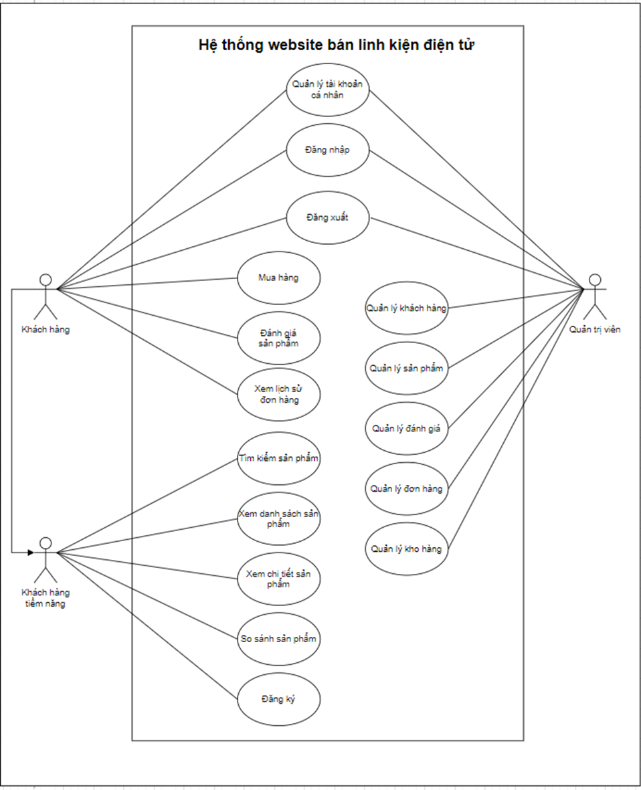
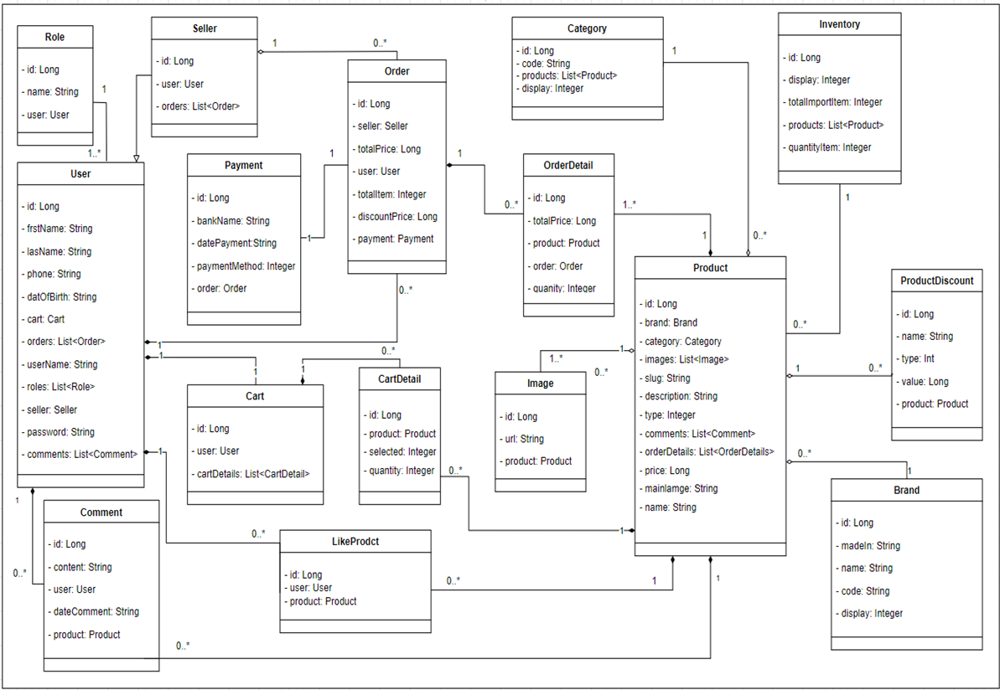
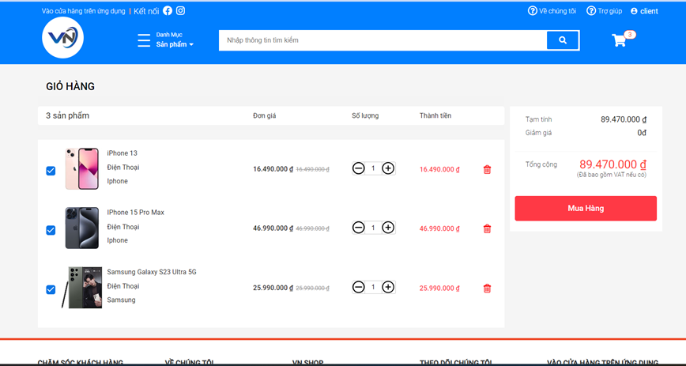
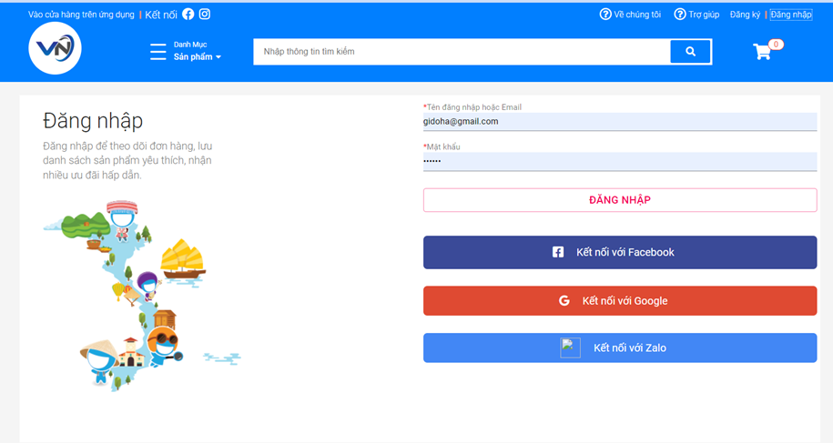

# Electronic Device E-commerce Website

This project is an e-commerce website for selling electronic devices. It provides a platform for customers to browse, search, and purchase various electronic products online.

## Table of Contents

- [Diagram](#diagram)
- [Features](#features)
- [Project Structure](#project-structure)
- [Technologies Used](#technologies-used)
- [Getting Started](#getting-started)
- [Contributing](#contributing)
- [License](#license)

## Diagram

## Features

### For Customers

- Browse product catalog
- Search for products
- View detailed product information
- Add products to cart
- Checkout process
- User registration and login
- Order history
- Product reviews and ratings
- Payment options (Credit card, Zalopay, Momo)
- Choose shipping options
- Chatbot support

### For Administrators

- Product management
- Customer management
- Order management
- Inventory management
- Review management

## Project Structure

This project is divided into four main components:

1. Backend: [Link to Backend Repository](https://github.com/nguyenphuctien4865/Ecommerce_server)
2. Frontend-Admin: [Link to Frontend Repository](https://github.com/UTE-Ecommerce-Chatbot/Ecommerce_admin)
3. Frontend-User: [Link to Frontend Repository](https://github.com/UTE-Ecommerce-Chatbot/Ecommerce_client)
4. Rasa Chatbot: [Link to Rasa Repository](https://github.com/UTE-Ecommerce-Chatbot/Ecommerce_Chatbot)

## Technologies Used

- Backend:
  - Java 8
  - Spring Boot
  - Spring JPA
  - Spring Security
  - Spring Boot Starter Mail
  - SLF4J
  - ...
- Backend Chatbot:

  - Rasa
    

- Frontend:
  - ReactJS
- Database:
  - MySQL

## Getting Started

[Provide instructions on how to set up and run the project locally]

## Contributing

- Nguyen Phuc Tien - 20110573
- Lau Viet Van - 20110598

## License

This project is licensed under the MIT License - see the [LICENSE](LICENSE) file for details.
